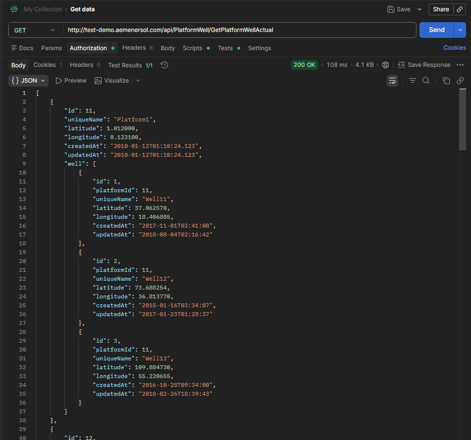
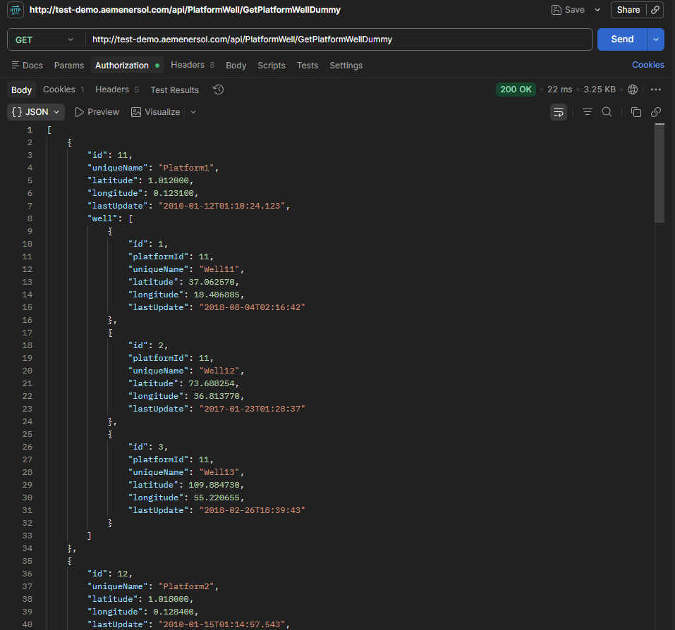
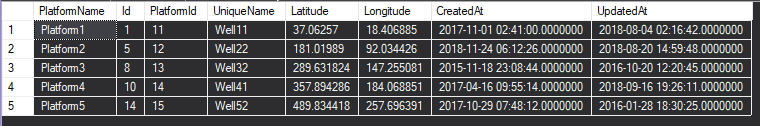

# AEM Enersol - Software Developer Technical Assessment
**Submitted by:** funmeen  
**Time taken:** ~3 hours

---

## Part 1: .NET Application

### Approach

Before writing any code, I started by exploring the API through Swagger at `http://test-demo.aemenersol.com/index.html` to understand the data structure. I logged in using the provided credentials, tested the `GetPlatformWellActual` endpoint, and observed the JSON response carefully. This helped me plan the database schema before touching any code.

From the Swagger response I noticed:
- Each record is a **Platform** object with a nested **well** array inside it
- The date field is called `lastUpdate`, not `updatedAt`
- Some platforms have no wells at all (Platform6 to Platform10)

Once I understood the data shape, I designed two tables — Platform and Well — and built the sync logic around that.

### Tech stack
- .NET 8 Console Application
- Entity Framework Core (Code First) with SQL Server LocalDB
- Newtonsoft.Json for resilient JSON deserialization
- Dependency Injection via `Microsoft.Extensions.DependencyInjection`

### How it works
1. The app logs in to the API and retrieves a bearer token
2. It calls `GetPlatformWellActual` using that token
3. For each platform and its nested wells, it upserts into the database (insert if new, update if exists)
4. It then calls `GetPlatformWellDummy` to verify the app handles missing or extra JSON fields without breaking




### Resilience to API changes
All DTO properties are nullable, so missing JSON keys don't cause errors. `[JsonExtensionData]` absorbs any new unknown fields silently. `MissingMemberHandling.Ignore` is set on the deserializer as an extra safety net.

### How to run
```
cd PlatformWellSync
dotnet restore
dotnet run
```

The app creates the database and tables automatically on first run, then syncs all data.

### Hardest part
The trickiest part was troubleshooting the database and API connection together. The API returned a nested JSON structure (platforms containing wells) which was different from what I initially expected based on the assessment screenshot. I had to inspect the raw API response through Swagger first, then adjust the data models to match the actual structure before the sync worked correctly.

Coming from Python, JavaScript, and PHP, the .NET and Entity Framework setup was also new to me — especially getting the database tables to create properly using Code First.

---

## Part 2: SQL Query

The query returns the last updated well for each platform, matching the expected result from the assessment.

```sql
SELECT p.PlatformName, w.Id, w.PlatformId,
       w.UniqueName, w.Latitude, w.Longitude,
       w.CreatedAt, w.UpdatedAt
FROM Well w
INNER JOIN Platform p ON p.Id = w.PlatformId
INNER JOIN (
    SELECT PlatformId, MAX(UpdatedAt) AS LastUpdatedAt
    FROM Well
    GROUP BY PlatformId
) latest ON w.PlatformId = latest.PlatformId
       AND w.UpdatedAt = latest.LastUpdatedAt
ORDER BY p.PlatformName;
```


The subquery groups wells by platform and finds the most recent `UpdatedAt` value for each. The outer query then joins back to get the full well details for that row.

---

## Project Structure
```
PlatformWellSync/
├── Models/
│   ├── Platform.cs
│   └── Well.cs
├── Data/
│   └── AppDbContext.cs
├── DTOs/
│   └── ApiDtos.cs
├── Services/
│   ├── ApiService.cs
│   └── SyncService.cs
├── Program.cs
├── PlatformWellSync.csproj
└── Part2_LastUpdatedWellPerPlatform.sql
```